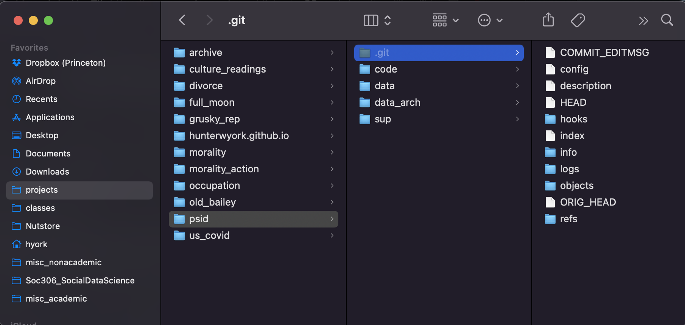
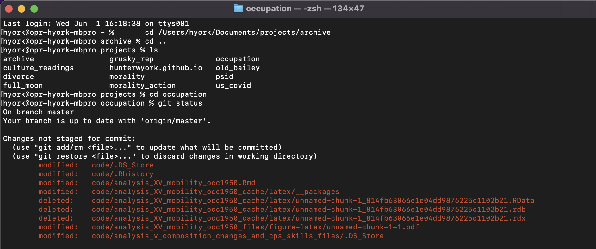
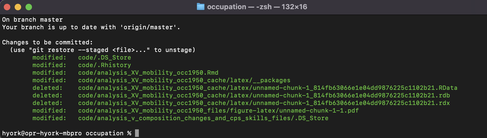
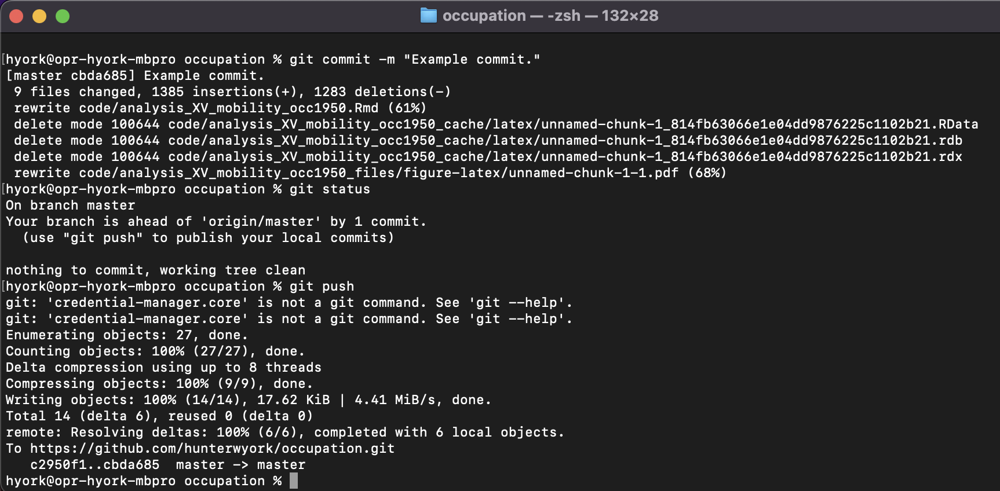
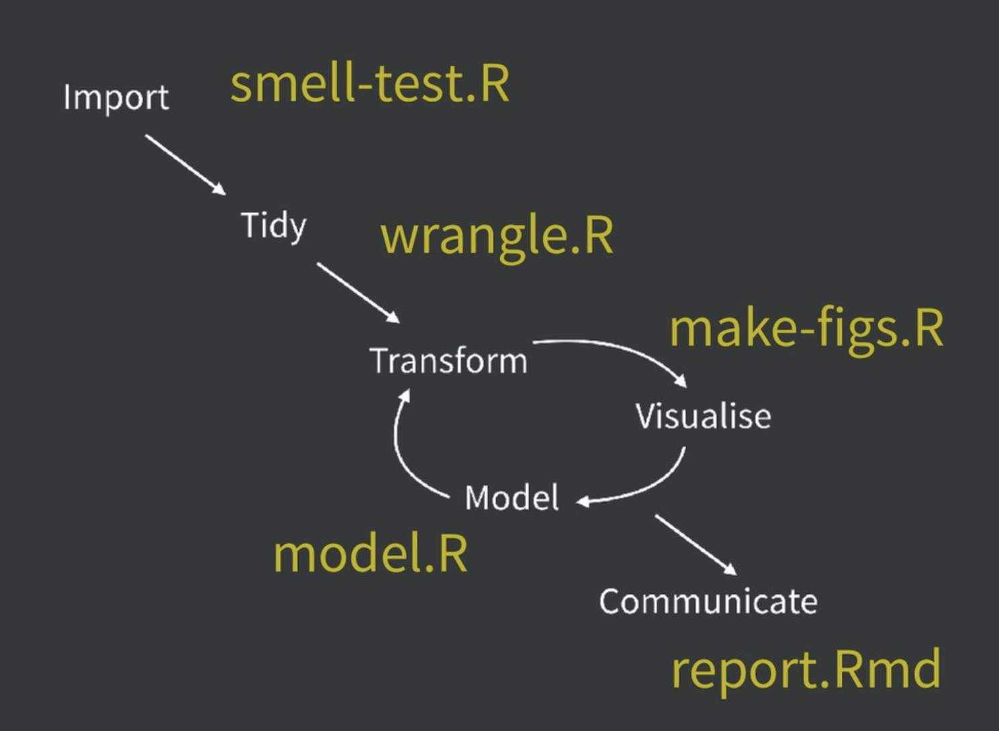

```{r setup, include=FALSE}
library(ggplot2)
library(data.table)
library(dplyr)
knitr::knit_hooks$set(time_it = local({
  now <- NULL
  function(before, options) {
    if (before) {
      # record the current time before each chunk
      now <<- Sys.time()
    } else {
      # calculate the time difference after a chunk
      res <- difftime(Sys.time(), now)
      # return a character string to show the time
      paste("Time for this code chunk to run:", res)
    }
  }
}))

knitr::knit_hooks$set(mysize = function(before, options, envir) {
  if (before) 
    return(options$size)
})
knitr::opts_chunk$set(echo = T, mysize = T, size='\\tiny', 
                       warning=F, error=F, message=F)

```

## Who am I?

::: columns

:::: column

  > - Rising third-year PhD student in Sociology at Princeton, Office of Population Research Affiliate
  > - Formerly: MPH at UW and researcher at Institute for Health Metrics and Evaluation, Formerly: AB at Harvard in  Human Evolutionary Biology and Music
  > - Interests: Stratification, culture, quant

::::

:::: column

{#id .class width=150 height=150}

::::

:::
      
## Goals
  > - This presentation will teach you very few hard skills.
  > - At best, it will introduce you to concepts that you can explore on your own to try to make up for deficiencies you notice in your code.
  > - Git is a very flexible program, with many many use cases. This tutorial is catered towards use in academic research settings.
  > - If you have questions during the presentation, STOP ME! No question is too simple.

## Useful Links

  > - [Git for Novices](https://swcarpentry.github.io/git-novice/)
  > - [Super Basic Git Workflow for collaboration (fork, edit, push, pull request)](https://github.com/hunterwyork/microteaching)
  > - [Another Git Tutorial](https://product.hubspot.com/blog/git-and-github-tutorial-for-beginners)
  > - For a helpful introduction to Git and GitHub: [https://www.analyticsvidhya.com/blog/2020/05/git-github-essential-guide-beginners/](https://www.analyticsvidhya.com/blog/2020/05/git-github-essential-guide-beginners/)
  
# Questions?

# Why I'm teaching what I'm teaching.

## Outline

  > - What is Git?
  > - What is Github?
  > - Designing a workflow around Git
  > - Using Git: 4 Use Cases
  >     - Basic version control
  >     - Backtracking, branching
  >     - Collaboration
  >     - Tweaking an existing project
  

# What is git?

## Git

  > - Git is a local program on your computer. 
  > - Many machines come with it preinstalled. 
  >     - To check open Terminal/Command Line and type "git"
  > - Software available [here](https://git-scm.com/)
  
## Why use git?

  > - Free and open source!
  > - Forces you to think in a structured way about your code.
  >     - "What changes have I made since I last saved my code?"
  > - EVERYTHING IS SAVED!
  
# What is Github?

## Github

  > - Online "mirror" of git. 
  > - Allows remote backups.
  > - Allows collaboration.
  > - Built in GUI (Graphical user interface)
  > - Allows permanent record of code (for publishing papers for example)


# Designing a workflow around Git

## Project-based design

::: columns

:::: column

  > - Knowing where your files are allows you to spend more time doing what's important: writing code!
  > - A project is simply, start to finish, everything to get you from idea to finished paper
  > - It includes code, data, output files like clean datasets, figures, and possibly a manuscript
  > - Most importantly, by having all your files in one directory and using relational paths, you make the entire project replicable!
  
::::

:::: column

{#id .class width=150 height=200}

::::

:::


## My Workflow (starting a new project)

  > - Create a folder on my computer for each project. 
  >     - "/Users/hyork/Documents/projects/NAME_OF_PROJECT"
  > - Format subdirectories in a similar manner for all projects
  >     - "../code", "../inputs", "../outputs", "../ref"
  > - Start a git repository in the main directory and keep up-to-date with GitHub.


  >     - NB: Git has a lot of features built out for collaboration that are not necessary for basic data management. If you learn a simple "add," "commit," "push" workflow, it will serve most of your needs.
  > - A git repository can exist in either just your code directory or in the parent directory. This will depend on if you want to have everything version controlled.

## Workflows

{#id .class width=350 height=200}


## A Note on Git

{#id .class width=200 height=300}

# Git overview - Starting a repo

## Git init

  > - `git init` is a command which initiates git in a directory. 
  > - I navigate to my folder of choice (`../code`), and in it I use this command.
  > - Under the hood, this command creates an invisible subdirectory (`../code/.git`) which git uses to keep track of all my files. 

{#id .class width=400 height=180}

## git status

  > - At any time, you can use `git status` to check what has happened within a folder containing a git repo. 
  > - The below output shows what it might look like. 
{#id .class width=400 height=180}

## Git Add

  > - Once you have made changes in a repo, you can `git add` them. 
  > - This "stages" them, preparing a commit that can soon be pushed. 
  > - Adding is as simple as typing `git add filename.R`
  > - To add all files in a directory, type `git add .`
  > - You can also set files to be ignored every time, so that you can use `git add .` without having it actually pay attention to unimportant files.
  
## Git Add

{#id .class width=400 height=130}

## Git Commit & Push

  > - Finally, you can use `git commit` to add a commit message to your staged items. This is an informative label that summarizes what you've done since the last commit.
  > - Git push finalizes the commit by pushing local commits.
  
{#id .class width=400 height=250}

## Git Remotes

  > - Everything done until now has **only** used git and not github. 
  > - All changes are saved locally, and I can use git in the terminal to explore previous commits. 
  > - However, if I delete the hidden `.git` folder, my computer dies, or something else happens, all previous changes will be lost forever.
  > - Enter, Github!

## Git Remote

  > - After `git init`, the first thing I like to do is sync git with github. 
  >     - This only has to be done once, and then all other git commands automatically duplicate changes locally to the remote. 
  > - On www.github.com, you can follow the simple directions to set up a remote repo. You can then follow the given instructions to sync your local repo with the remote. 
  > - An example command would be something like `git remote add origin https://github.com/hunterwyork/occupation.git`
  
## Git Remote

## Review

  > - `git init` initializes a repo in a folder.
  > - 


# Git overview - Collaboration

## Mass Collaboration

  > - I've worked on several 20+ author papers (and a few 1000+), but usually one one or two people are really in charge of data analysis, or it uses a structure where people work on separate chunks of code.
  > - Git provides a more truly collaborative alternative!
  > - Collaboration is hard. Tools like git, trello, and slack help. 
  > - Working in a lab setting? Use a lab handbook: [link](https://twitter.com/samuelmehr/status/1139733291899080705)
  > - Keys: norms, coordination, and communication.
  
## Cloning an existing repo

{#id .class width=400 height=300}


## Code Tips

1. Break down large projects into smaller chunks. 
  + For me, this usually looks something like having a "processing.R", "anlaysis.R", and a "figures.R" script. 
    + Tailor these to your specific project. If you have many lines of data acquisition and many lines of data processing, break that up!
  + Real programmers, data scientists working to make reproducible pipelines, etc. will all have drastically different standards of coding. Don't listen to them. Unless you're making a package to put on CRAN, you don't need a script for helper functions, etc. 
  + That said, if one of your files exceeds 1,000 lines, or you have a very time-consuming step in the middle of a script, consider breaking it up.
  + I love to save intermediate files in my scripts. Later, these form a natural place for me to break a script up if it gets too long. 
  
## Code Tips

### Workflows (within your "../scripts" or "../code" folder)

{#id .class width=300 height=210}

[https://speakerdeck.com/jennybc/zen-and-the-art-of-workflow-maintenance?slide=59](https://speakerdeck.com/jennybc/zen-and-the-art-of-workflow-maintenance?slide=59)

  
## Code Tips

2. Comment (when it helps you)! 
  + I actually rarely comment well until the final stages of a pipeline. BUT, that is because I'm so used to using a certain set of tools, that I can almost always tell what I'm doing. My comments are thus more limited to reminding myself why I made a certain choice or flags for me to revisit a small bug. 
3. Test clunky operations on smaller bits of data
  + Sometimes we get too ambitious. If your code is slow and you can't or don't want to optimize it, subset your data early on in the script, write your code using the subset, and in the last stage, run it on the full sample. 

## An aside on aesthetics

  > - **Aesthetics matter!**...*kind of*
  > - [CMD] + i will automatically indent your code to make it look better
  > - Line breaks can be done really however you'd like, though consistency will make it easier to read. 
  >     - If listing variables, for instance, I will often break after every 3 units or so.

\pause
### Example of using your own line breaks to make code neater

```{r, eval = F}
c("Hunter", "Mary", "Sol",
  "Joseph", "Jamal", "Carla",
  "Sara", "Emma", "Rod")
```

\pause
  > - I follow no particular style guide, but you will eventually figure out your own style.
  > - [http://adv-r.had.co.nz/Style.html](http://adv-r.had.co.nz/Style.html)
  > - [lintr](https://cran.r-project.org/web/packages/lintr/index.html)


# Questions?


# Questions, comments?

## Thank you!

  > - I can be reached at [hyork@princeton.edu](hyork@princeton.edu)
  > - Check out my website [hunterwyork.com](www.hunterwyork.com)
  > - If you found this presentation useful, share it!
  > - Rmarkdown file and slides are [here](https://github.com/hunterwyork/data_management_R).


