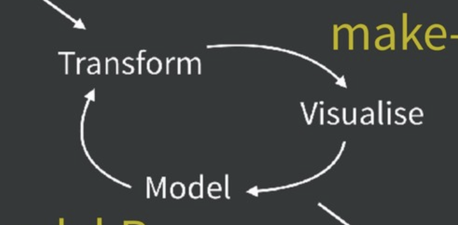
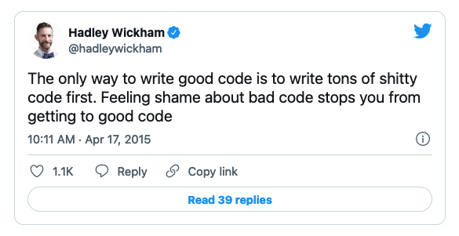

```{r setup, include=FALSE}
library(ggplot2)
library(data.table)
library(dplyr)
knitr::knit_hooks$set(time_it = local({
  now <- NULL
  function(before, options) {
    if (before) {
      # record the current time before each chunk
      now <<- Sys.time()
    } else {
      # calculate the time difference after a chunk
      res <- difftime(Sys.time(), now)
      # return a character string to show the time
      paste("Time for this code chunk to run:", res)
    }
  }
}))

knitr::knit_hooks$set(mysize = function(before, options, envir) {
  if (before) 
    return(options$size)
})
knitr::opts_chunk$set(echo = T, mysize = T, size='\\tiny', 
                       warning=F, error=F, message=F)

```

## Lecture Prereqs

  > - This lecture meant to give you a set of tools to take you from writing bad R code to writing slightly better R code.
    + It assumes basic proficiency in R:
      + How to assign variables; how to manipulate them using basic operations
      + How to run a linear regression
      + Basic familiarity with tidyverse syntax and operations
      

## But first, who am I?

::: columns

:::: column

  > - Second-year PhD student in Sociology at Princeton, Office of Population Research Affiliate
  > - Formerly: MPH at UW and researcher at Institute for Health Metrics and Evaluation, Formerly: AB at Harvard in  Human Evolutionary Biology and Music
  > - Interests: Stratification, culture, quant

::::

:::: column

{#id .class width=150 height=150}

::::

:::
      
## Goals
  > - This presentation will teach you very few hard skills.
  > - At best, it will introduce you to concepts that you can explore on your own to try to make up for deficiencies you notice in your code.
  > - I've tried to pitch it to be accessible to nearly all coding levels. Hopefully you can all take something away from it no matter how long you've been coding. 
  > - If you have specific questions on topics not addressed in the presentation, ask at the end! I'm going to leave around 25 minutes for questions.
  > - If you have questions during the presentation, STOP ME! No question is too simple.

## Useful Links

  > - [What They Forgot to Teach You About R](https://rstats.wtf/)
  > - [R for Social Scientists](https://datacarpentry.org/r-socialsci/)
  > - [Git for Novices](https://swcarpentry.github.io/git-novice/)
  > - [Introduction to Data.Table](https://atrebas.github.io/post/2020-06-17-datatable-introduction/#aggregation-by-group)
  > - [Super Basic Git Workflow for collaboration (fork, edit, push, pull request)](https://github.com/hunterwyork/microteaching)
  > - [The Summer Institutes in Computational Social Science!!](https://sicss.io/overview)
  > - [R for Data Science](https://r4ds.had.co.nz/index.html)
  > - [Data.table cheatsheet](http://datacamp-community-prod.s3.amazonaws.com/008e41e8-7526-4bbc-806b-8c828dfb81d4)
  > - [Dplyr cheatsheet](https://www.rstudio.com/wp-content/uploads/2015/02/data-wrangling-cheatsheet.pdf)
  > - [ggplot cheatsheet](https://raw.githubusercontent.com/rstudio/cheatsheets/main/data-visualization.pdf)
  > - [Other cheatsheets](https://www.rstudio.com/resources/cheatsheets/)

# Questions?

# Why I'm teaching what I'm teaching.

## Outline

  > - Project Design and Data Management
  > - Code Optimization
  >     - Principles of
  >     - Profiling
  >     - Vectorizing Code
  >     - Some examples of bad code
  > - Data Management and Reshaping Efficiently
  > - Parallelization

# Project Design and Data Management

## Some Code-Writing Theory

  > - Don't rewrite your code or a pipeline unless the time saved is greater than the time invested (for you or for anyone using your code)
  > - If you make tweaks to your code writing process, which may take an initial investment of time, the time saved in the long run will be worth it.
  >     - You don't have to be a computer scientist to write amazing R code.
  > - Learn a workflow, tailor it to your needs, replicate it endlessly.
  >     - MANY R tips and tricks online will not be useful to you. Social scientists in academia are different from social scientists in industry, from data scientists, and from all other R users (hard sciences, statisticians, etc.).
  > - Version often, save versions remotely (git + github or even dropbox)
  
## What is a project

::: columns

:::: column

  > - Knowing where your files are allows you to spend more time doing what's important: writing code!
  > - A project is simply, start to finish, everything to get you from idea to finished paper
  > - It includes code, data, output files like clean datasets, figures, and possibly a manuscript
  > - Most importantly, by having all your files in one directory and using relational paths, you make the entire project replicable!
  
::::

:::: column

{#id .class width=150 height=200}

::::

:::


## My Workflow (starting a new project)

  > - Create a folder on my computer for each project. 
  >     - "/Users/hyork/Documents/projects/NAME_OF_PROJECT"
  > - Format subdirectories in a similar manner for all projects
  >     - "../code", "../inputs", "../outputs", "../ref"
  > - Start a git repository in the main directory and keep up-to-date with GitHub.
  >     - For a helpful introduction to Git a. GitHub: [https://www.analyticsvidhya.com/blog/2020/05/git-github-essential-guide-beginners/](https://www.analyticsvidhya.com/blog/2020/05/git-github-essential-guide-beginners/)
  >     - [Super Basic Git Workflow for collaboration (fork, edit, push, pull request)](https://github.com/hunterwyork/microteaching)
  >     - NB: Git has a lot of features built out for collaboration that are not necessary for basic data management. If you learn a simple "add," "commit," "push" workflow, it will serve most of your needs.

## Workflows

{#id .class width=350 height=200}


## A Note on Git

{#id .class width=200 height=300}

## A Note on Git

{#id .class width=400 height=300}


## Code Tips

1. Break down large projects into smaller chunks. 
  + For me, this usually looks something like having a "processing.R", "anlaysis.R", and a "figures.R" script. 
    + Tailor these to your specific project. If you have many lines of data acquisition and many lines of data processing, break that up!
  + Real programmers, data scientists working to make reproducible pipelines, etc. will all have drastically different standards of coding. Don't listen to them. Unless you're making a package to put on CRAN, you don't need a script for helper functions, etc. 
  + That said, if one of your files exceeds 1,000 lines, or you have a very time-consuming step in the middle of a script, consider breaking it up.
  + I love to save intermediate files in my scripts. Later, these form a natural place for me to break a script up if it gets too long. 
  
## Code Tips

### Workflows (within your "../scripts" or "../code" folder)

{#id .class width=300 height=210}

[https://speakerdeck.com/jennybc/zen-and-the-art-of-workflow-maintenance?slide=59](https://speakerdeck.com/jennybc/zen-and-the-art-of-workflow-maintenance?slide=59)

  
## Code Tips

2. Comment (when it helps you)! 
  + I actually rarely comment well until the final stages of a pipeline. BUT, that is because I'm so used to using a certain set of tools, that I can almost always tell what I'm doing. My comments are thus more limited to reminding myself why I made a certain choice or flags for me to revisit a small bug. 
3. Test clunky operations on smaller bits of data
  + Sometimes we get too ambitious. If your code is slow and you can't or don't want to optimize it, subset your data early on in the script, write your code using the subset, and in the last stage, run it on the full sample. 

## An aside on aesthetics

  > - **Aesthetics matter!**...*kind of*
  > - [CMD] + i will automatically indent your code to make it look better
  > - Line breaks can be done really however you'd like, though consistency will make it easier to read. 
  >     - If listing variables, for instance, I will often break after every 3 units or so.

\pause
### Example of using your own line breaks to make code neater

```{r, eval = F}
c("Hunter", "Mary", "Sol",
  "Joseph", "Jamal", "Carla",
  "Sara", "Emma", "Rod")
```

\pause
  > - I follow no particular style guide, but you will eventually figure out your own style.
  > - [http://adv-r.had.co.nz/Style.html](http://adv-r.had.co.nz/Style.html)
  > - [lintr](https://cran.r-project.org/web/packages/lintr/index.html)

## Mass Collaboration

  > - I've worked on several 20+ author papers (and a few 1000+), but usually one one or two people are really in charge of data analysis, or it uses a structure where people work on separate chunks of code.
  > - Git provides a more truly collaborative alternative!
  > - Collaboration is hard. Tools like git, trello, and slack help. 
  > - Working in a lab setting? Use a lab handbook: [link](https://twitter.com/samuelmehr/status/1139733291899080705)
  > - Keys: norms, coordination, and communication.
  
# Questions?

# Code Optimization

## Theory of Code Optimization

  > - I only optimize code that is essential to my coding process.
  
{#id .class width=100 height=50}
  
  > - Code is very often slow-running because of bottlenecks.
  > - Tweaking bottlenecks is often worth it.
  > - If a bottleneck cannot be fixed or if it's not worth it to fix it, consider removing it from your code.
    + Make a separate script for it, that way you're only editing the chunk of code before or after it modularly, and you're not running the bottleneck every time you rerun your script.

*But how do you fix a bottleneck? ....*


## Theory of Code Optimization

### Problem

  > - You have code that runs seems to be running slow but you dont know how to identify the rate-limiting step

\pause  
### Solution

  > - RStudio's built-in profiler! (Or bespoke profiling)

## Speeding up code

### Profiling with rstudio's built-in profiler

  > - The basic theory of profiling is that it helps you locate bottlenecks in your process.
  >     - It may also help you identify what part of the bottleneck is the most critical thing to fix.
  > - Often times, you can tell what a bottleneck is by simply looking at your code and watching it run.
  > - However, if you're running a for loop or a function, seeing inside the chunk is much harder. 
  > - You can profile any amount of code, allowing you to optimize within and outside of such chunks.
  

## Speeding up Code

### Profiling with rstudio's built-in profiler

  > - Profiling
  >     - [Profiling Introduction Link](https://support.rstudio.com/hc/en-us/articles/218221837-Profiling-R-code-with-the-RStudio-IDE)

### Here's an example of some code we're going to profile
```{r slide1, eval = F, echo = T}
f <- function() {
  profvis::pause(0.1)
  g()
  h()
}
g <- function() {
  profvis::pause(.1)
  h()
}
h <- function() {
  profvis::pause(0.1)
}
profvis::profvis({f()})
```

## Speeding up Code

{#id .class width=320 height=300}

## An alternative to profiling

### You can also wrap your code in *system.time({})* for a more bespoke analysis.

```{r}
library(data.table)
system.time({Sys.sleep(5)})
system.time({Sys.sleep(1)})

```

## Speeding up code, a review

  > - Not all code needs to be fast.
  > - Profiling with Rstudio's built-in profiler is very handy!
  > - Alternatively, use *system.time*.
  > - If you don't want to make code more efficient, excise the clunky bits from your script so you don't keep running it every time you run your script.

  
# Questions?

# Speeding Up Code - Going from bad for-loops to better for-loops to vectorized code (functions + lapply)

## Functions

"To become significantly more reliable, code must become more transparent. In particular, nested conditions and loops must be viewed with great suspicion. Complicated control flows confuse programmers. Messy code often hides bugs."

— Bjarne Stroustrup

"A common use of functionals is as an alternative to for loops. For loops have a bad rap in R because many people believe they are slow, but the real downside of for loops is that they’re very flexible: a loop conveys that you’re iterating, but not what should be done with the results."

— Hadley Wickham [https://adv-r.hadley.nz/functionals.html](https://adv-r.hadley.nz/functionals.html)

## Speeding up code: vectorizing Code

  > - For loops are often memory intensive
  >     - Common use-case: grow an object with each iteration of the loop. This might be something like "rbind" to add a row to the end of a dataframe.
  >     - Each iteration reallocates the object in your computer's memory. 
  > - Alternatives including allocating the object beforehand or using lapply, sapply, etc. 
  > - lapply, sapply, mapply and functions are a more efficient way to code, and being in a function-based mindset can help you tackle problems that might be hard to wrap your head around with alternatives in R.
  > - Vectorization here applies to "Array Programming" which simply means applying a function to an array all at once instead of piecewise.

## A refresher on functions

  > - [swcarpentry](https://swcarpentry.github.io/r-novice-inflammation/02-func-R/) has a good review of functions.
  > - Functions allow a method to be replicated in different parts of your code without rewriting the method
  > - They are written by wrapping a block of code in:
  >     - *function(arg1, arg2, ...){...code goes here}*
  > - They use the syntax *FUN(arg1, arg2, ...)* to evaluate
  > - *lapply* (list apply) takes the arguments *X* and *FUN* where *X* is a list or vector of items to iterate the function over, and *FUN* is the function. You can also pass on other arguments but they must stay the same for all evaluations of the function.

## A refresher on functions

### An example of a basic function, how to use lapply

```{r}
# Serial replication can be replaced easily!
x <- 1 + 1
y <- 2 + 1
z <- 3 + 1
```

\pause
```{r}
# Write a function and assign it as an object
add_1 <- function(w){
  return(w + 1)
}
```

\pause
```{r}
# Run a function on one thing at a time
add_1(1)
add_1(2)

```

\pause
```{r}
# Use lapply to run it over a list (or vector)
lapply(3:5, add_1)
```

## Quick Data Introduction

  > - For the next few slides, I'll be using data from NLSY 97, a file containing basic demographic information and yearly income numbers for each participant.


```{r slide2, echo = T}
source("song.R")
setnames(new_data, c("PUBID", "inc_1997", "sex", "bdate_mo",
                     "bdate_yr", "sample_type", "race", 
                     paste0("inc_", 1998:2011), 
                     paste0("inc_", seq(2013, 2019, 2))))
new_data <- new_data[,c(1,3,7, 21:25)]
new_data <- data.table(new_data)
new_data <- new_data[complete.cases(new_data)]
head(new_data)
```


## Replacing for-loops with functions  > - *Single Iteration Example*

 - This task iterates over model designs. Vroom is a package in dplyr made to do a similar task. This might be useful in an exploratory data analysis or in a robustness check in a sensitivity analysis.

### Setting up the task, choosing variables to iterate over as dependent variables in a regression.

```{r slide3.1}
regress_vars <- names(new_data)[2:length(names(new_data))] # select variables to use in analysis
```

\pause
```{r}
c.vars <- regress_vars[c(1,2,3)] # select ind. variables
```

\pause
```{r}
c.outcome <- regress_vars[7] # select dep. var
```

\pause
```{r}
print(c.vars)
print(c.outcome)
```

## Replacing for-loops with functions - *Single Iteration Example*

### Copy data, collapse variables into a formula

```{r slide3.2}
c.dat <- copy(new_data) # copy data frame for this analysis
                        # This is unnecessary but helps us prepare
                        # to use a function
```

\pause
```{r}
form <- as.formula(             # collapse ind. and dep. vars to a formula
  paste0(c.outcome, " ~ ", 
         paste0(c.vars, collapse = " + "))
)
```

\pause
```{r}
print(form)             # Print the formula
```

# Questions?

# Replacing for-loops with functions - *Single Iteration Example*

## Replacing for-loops with functions - *Single Iteration Example*

### Run the model and collect the results in a data.table

```{r slide3.3}
mod <- lm(formula = form, data = c.dat) # evaluate model
```

\pause
```{r}
mod_betas <- data.table(round(summary(mod)$coefficients[, 1:2],5), 
                        keep.rownames = T) # here I'm using data.table syntax
                                           # but this can be done in base R or dplyr
```

\pause
```{r}
mod_betas[, ind_vars := paste0(c.vars, collapse = ", ")] # Create an ID variable to know which model I ran
```

\pause
```{r}
mod_betas[1:4] # display outputs: estimates and SEs for each coefficient, with ID vars to describe model run
```

# Questions?

# Replacing for-loops with functions - *Bad For-Loop Version (multiple iteration example)*

## Replacing for-loops with functions - *For-Loop Version (multiple iteration example)*

  > - Now we want to do the same thing, using different model specifications.
  > - In the for loop, I will loop over different combinations of printed variables. In the bad for loop example, I append my data.table to a preexisting data.table, which takes a lot of memory and time. This gets worse as the data.table grows longer (as the for loop keeps going).

## Replacing for-loops with functions - *For-Loop Version (multiple iteration example)*

### Step 1

  > - Establish a list of independent variable combinations to run model on. This is a list of vectors.

```{r slide4.1}
vars_vec <- replicate(3, expr = 
                        sample(regress_vars[regress_vars != "inc_2019"], 3), simplify = F)
                        # above, I chose some random independent variables by 
                        # sampling from all the possible choices and I assembled
print(vars_vec[1:2])    # them into a list of combinations. Here I print them.
```

## Replacing for-loops with functions

###  Step 2 - Run a model over each combination of independent variables

```{r slide4.2}
all_betas <- data.table() # Establish an empty data.table to hold results
```

\pause
```{r, time_it = T}
for(c.vars in vars_vec){  # loop over each combination of independent variables to regress
  form <- as.formula(     # create formula using ind. and dep. variables
    paste0(c.outcome, " ~ ", 
           paste0(c.vars, collapse = " + "))
  )
  mod <- lm(formula = form, data = c.dat)  # Run model
  
  # Accumulate summary stats for each variable in regresssion
  mod_betas <- data.table(round(summary(mod)$coefficients[, 1:2],5), keep.rownames = T)
  mod_betas[, ind_vars := paste0(c.vars, collapse = ", ")] # Create an variable to know which model I ran
  # The below step is the most memory intensive!
  # It rewrites the entire object, growing larger with each iteration.
  all_betas <- rbind(all_betas, mod_betas) # append results to preexisting data table
}
```

\pause
```{r}
head(all_betas)
```

# Questions?

# Replacing for-loops with functions - *Better For-Loop Version (multiple iteration example)*

## Replacing for-loops with functions - *Better For-Loop Version (multiple iteration example)*

### Better for-loop version - Write to a list of data.tables

  > - This version of the same code replaces the object that holds the outcomes of the different models. Instead of appending to one ever-growing data.table, we append each model result (a data.table) to a list of data.tables. This doesn't require removing the list from memory and replacing it.

```{r slide5.1}
all_betas_list <- list() # create an empty list
```

\pause
```{r}
i <- 0                   # create an index to add to with each iteration
```

\pause
```{r,time_it = T}
for(c.vars in vars_vec){
  i <- i + 1             # add to iterator
  form <- as.formula(    # create formula, as above
    paste0(c.outcome, " ~ ", 
           paste0(c.vars, collapse = " + "))
  )
  mod <- lm(formula = form, data = c.dat) # Run model
  mod_betas <- data.table(round(summary(mod)$coefficients[, 1:2],5), keep.rownames = T)
  mod_betas[, ind_vars := paste0(c.vars, collapse = ", ")]
  # This step saves memory by adding an element to a list
  # It does not copy the list or overwrite it in doing so
  all_betas_list[[i]] <- mod_betas
}

```

## Replacing for-loops with functions - *Better For-Loop Version (multiple iteration example)*

*The results are identical!)

### Better for-loop version - Write to a list of data.tables

```{r}
all_betas_list[1] # show what a list of data.tables looks like
```

\pause
```{r}

all_betas <- rbindlist(all_betas_list) # you can collapse the list of data.tables 
                                       # to one large data.table
```

\pause
```{r}
head(all_betas)
```

# Questions?

# Replacing for-loops with functions - *Functions and Vectorization! (multiple iteration example)*
  
## Replacing for-loops with functions - *Better For-Loop Version (multiple iteration example)*

### Functions + lapply (list apply)

```{r slide6.1}
modr <- function(c.dat, c.vars, c.outcome){ # write a function that takes in 3 arguments
  form <- as.formula(
    paste0(c.outcome, " ~ ", 
           paste0(c.vars, collapse = " + "))
  )
  mod <- lm(form, data = c.dat)
  mod_betas <- data.table(round(summary(mod)$coefficients[, 1:2],5), keep.rownames = T)
  mod_betas[, ind_vars := paste0(c.vars, collapse = ", ")]
  return(mod_betas) # return the data.table 
}
```

\pause
```{r, time_it = T}

lapply(vars_vec, modr, c.outcome = "inc_2019", c.dat = new_data) %>% 
  rbindlist() -> all_betas
```

\pause
```{r}

head(all_betas)
```

##

{#id .class width=350 height=200}

## Some actual examples of less-than-ideal code I found on the internet

### Original Code - Repeated tasks

```{r, eval = F}
# ORIGINAL
#remove idnumb, other ids
data[which(colnames(data) == "idnumb")] <- NULL
data[which(colnames(data) == "challengeIDs")] <- NULL
data[which(colnames(data) == "mothids1")] <- NULL
data[which(colnames(data) == "mothids2")] <- NULL
data[which(colnames(data) == "mothids3")] <- NULL
data[which(colnames(data) == "mothids4")] <- NULL
data[which(colnames(data) == "hv3mothids3")] <- NULL
data[which(colnames(data) == "hv4mothids4")] <- NULL
data[which(colnames(data) == "fathids1")] <- NULL
```

\pause
### Alternative Code - Using Built-In Functions

```{r, eval = F}
# ALTERNATIVE DPLYR
data <- data %>% select (-c(idnumb, challengeIDs, mothids1,
                            mothids2, mothids4, "........"))
# ALTERNATIVE DATA.TABLE
data[, c("idnum", "challengeID", "mothids1",
         "mothids2", "mothid4s", "........") := NULL]
```

## Some actual examples of less-than-ideal code I found on the internet

### Original: The problem - Calling a function once, on one dataset, using dataset names in the function

```{r, eval = F}
# ORIGINAL
# Remove cols with > 50% missing data 
f_lowInfo <- function(data) {
  ncols = ncol(data)
  nrows = nrow(data)
  to_remove = integer(ncols)
  for (i in 1:ncols) {
    if (sum(is.na(data[i])) > .5*nrows) {
      to_remove[i] = 1
    }
  }
  data[to_remove == 1] <- NULL
  return(data)
}
data <- f_lowInfo(data)
```

## Some actual examples of less-than-ideal code I found on the internet

### Alternative Code - Define a function, apply it multiple times, make it flexible

```{r, eval = F}
# ALTERNATIVE
is_col_missing <- function(c.vector){ # create a function to see if a vector is
  return(mean(is.na(c.vector)) > .5)  # over half missing. Use that TRUE = 1, and
}                                     # FALSE = T to our advantage
# Apply across columns of data.frame
data %>% summarize(across(.cols = everything(), is_col_missing)) -> to_remove
data <- data[,to_remove == 0] # remove predominantly empty columns
```

\pause
### Solution explained

  - This solution capitalizes on the idea that a function should be portable and should probably be used more than once if it really deserves to be a function.
  - Capitalizes on the structure of data frames as just groups of same-length vectors.

## Dplyr and data.table

  > - When equivalent operations exist in base R and dplyr or data.table, use either of the latter
  >     - these packages export many of their operations to C++, resulting in significant speed gains
  > - Data.table is often faster than dplyr, but the trade-off is usually insignificant. 
  > - Data.table has a more concise but more cryptic syntax, making it seemingly harder to learn and perhaps harder to understand.
  > - Dplyr is more commonly used in learning applications, data.table is more common in industry applications.
  > - dtplyr uses data.table backend with dplyr syntax!!
  
## Data.table-specific benefits

  > - 'data tables' are a slightly different kind of object in R
  > - All data frame syntax works on them, but there's also data.table specific syntax that you can use to your benefit
  > - Many processes in data.table are more memory efficient
  >     - Shallow copies vs. deep copies of data are made when performing certain tasks
  > - Really only necessary if your data is above 1 GB
  
## data.table, dplyr, base R cognates

  > - We can time each using "system.time()" to evaluate performance!
  > - Dplyr and Data.table are leagues faster!

```{r}
replicate(new_data, n = 5000, simplify = F) %>% rbindlist() -> new_data2
new_data[1:2]
dim(new_data)
```

\pause
```{r}

# Perform the same task using three different methods
system.time({ new_data2$inc_2011_2013 <- new_data2$inc_2011 + new_data2$inc_2013 })  # Base R
```

\pause
```{r}
system.time({ dplyr::mutate(new_data2, inc_2011_2013 = inc_2011 + inc_2013) }) # Dplyr
```

\pause
```{r}
system.time({ new_data2[, inc_2011_2013 := inc_2011 + inc_2013] }) #Data.table 
```
  
## data.table/tidyverse tricks

  > - vroom::vroom()/data.table::fread()/::fwrite() for reading/writing csvs
    + (Uses built-in parallelization!)
  > - lag/lead for shifting components with temporal data
  > - frollmean/rollmean/(f)rollsum, etc. for computing rolling window averages/sums
  > - dcast/melt in data.table pivot_wider/pivot_longer for efficient reshaping (to be covered later)
  > - Don't use the $ operator ever with data.frames/data.tables!
  
# Questions?

# Data Management and Reshaping Efficiently
  
## Data Storage Tricks

### Be cognizant of what kinds of storage your data frame uses

  > - Long strings are memory intensive.
  > - Lower-precision numerical types save space!

```{r}
object.size("Hello") # a character string containing "Hello"
object.size(paste0(rep("Hello", 20), collapse = " ")) # Hello Repeated 20 times
object.size(numeric(1000)) # Float64
object.size(integer(1000)) # Integers take up less space

```

## Efficient reshaping

  > - data.table was first to the scene with optimized versions of reshape2's functions
    + data.table::melt() and data.table::dcast()
  > - tidyr::pivot_longer was inspired by data.table's melt(), and usually performs faster than base R, but I think data.table's reshpaing tools are generally faster.

## Data storage considerations

### Wide data is often more space efficient, up to a point. 

```{r, warning=F}
df <- data.frame(Hunter = c(1,2,3), 
                 Wade = c(2,4,6), 
                 York = c(3,6,9), 
                 multiplier = c(1,2,3))
```

\pause
```{r}
head(df) #wide 
```

\pause
```{r}
df_long <- melt(df, id.vars = "multiplier")
```

\pause
```{r}
head(df_long) #long
```

\pause
```{r}

object.size(df)
object.size(df_long)
```

# Questions?

# Parallelization

## Parallelization

  > - A related concept to vectorization is parallelization. Just as you can take an operation and apply it to an entire array instead of each item of an array, you can have multiple chunks of code run simultaneously if your machine is capable of this. 

{#id .class width=200 height=150}'

## Parallelization

  > - My computer has "1.4GHz quad-core Intel Core i5, Turbo Boost up to 3.9GHz, with 128MB of eDRAM"
  > - Parallelization using R is actually a little funky, and so it will allow parameters that shouldn't work, and language gets slippery (cores vs. threads).
    + Disclaimer: I don't understand computers! With parallelization, profile to make sure your code is actually faster, because confusing things happen.


```{r}
parallel::detectCores()
```

## Parallelization

### Define your function

```{r slide7, warning=F}
modr <- function(c.dat, c.vars, c.outcome){
  form <- as.formula(
    paste0(c.outcome, " ~ (1|", 
           paste0(c.vars, collapse = ") + (1|"), 
           ")")
  )
  mod <- lme4::lmer(form, data = c.dat)
  mod_betas <- data.table(summary(mod)$coefficients[, 1:2], keep.rownames = T)
  mod_betas[, ind_vars := paste0(c.vars, collapse = ", ")]
  return(mod_betas)
}
```

This is a computationally expensive function. I've changed the model to a random effects model to use more computation power.

### Get a longer vector of variables to iterate over.

```{r}
vars_vec <- replicate(20, expr = 
                        sample(regress_vars[regress_vars != "inc_2019"], 3), simplify = F)

```

## Parallelization


### Serial - 1 Iteration


```{r slide8.1, time_it = T, warning=F, error=F, message=F}
modr(vars_vec[[1]], c.dat = new_data, c.outcome = "inc_2019")
```


### Serial - 20 Iterations


```{r slide8.2, time_it = T, warning=F, error=F, message=F}
lapply(vars_vec, modr, c.outcome = "inc_2019", c.dat = new_data) %>% 
  rbindlist() -> all_betas
```


### Parallel - 20 Iterations


```{r slide8.3, time_it = T, warning=F, error=F, message=F}
parallel::mclapply(vars_vec, modr, c.outcome = "inc_2019",
                   c.dat = new_data, mc.cores = 4) %>% 
  rbindlist() -> all_betas
```

There is overhead associated with despatching and receiving each task, resulting in a tradeoff that you have to manage!

    
## Parallelization 

  > - The backends of several packages in R will automatically parallelize. 
  >     - Model-fitting, loading data, etc.
  > - This is a handy tool to learn if you need to use cluster-based supercomputing since there are similar concepts.
  


# Questions, comments?

## Thank you!

  > - I can be reached at [hyork@princeton.edu](hyork@princeton.edu)
  > - Check out my website [hunterwyork.com](www.hunterwyork.com)
  > - If you found this presentation useful, share it!
  > - Rmarkdown file and slides are [here](https://github.com/hunterwyork/data_management_R).


