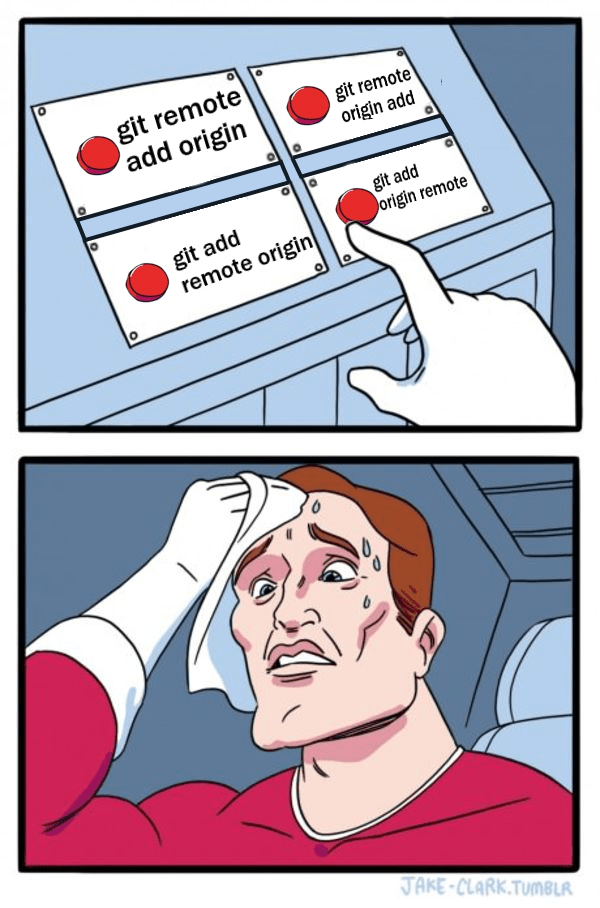
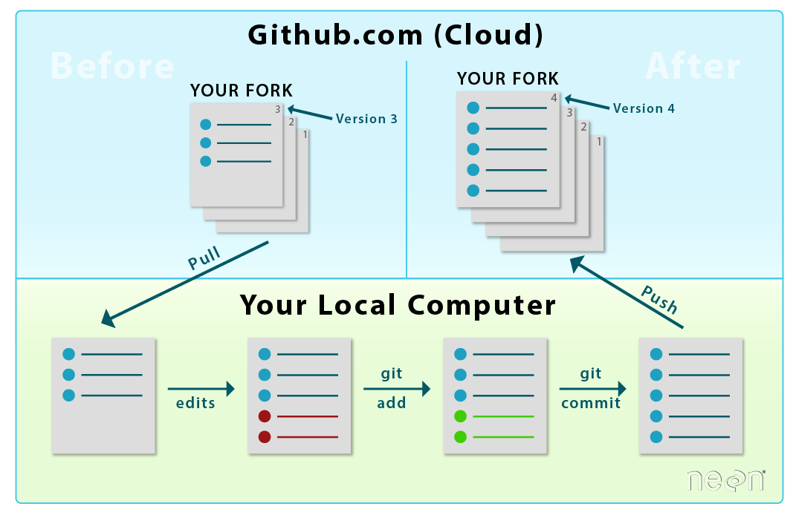

```{r setup, include=FALSE}
library(ggplot2)
library(data.table)
library(dplyr)
knitr::knit_hooks$set(time_it = local({
  now <- NULL
  function(before, options) {
    if (before) {
      # record the current time before each chunk
      now <<- Sys.time()
    } else {
      # calculate the time difference after a chunk
      res <- difftime(Sys.time(), now)
      # return a character string to show the time
      paste("Time for this code chunk to run:", res)
    }
  }
}))

knitr::knit_hooks$set(mysize = function(before, options, envir) {
  if (before) 
    return(options$size)
})
knitr::opts_chunk$set(echo = T, mysize = T, size='\\tiny', 
                       warning=F, error=F, message=F)

```

## Who am I?

::: columns

:::: column

  > - Rising third-year PhD student in Sociology at Princeton, Office of Population Research Affiliate
  > - Formerly: MPH at UW and researcher at Institute for Health Metrics and Evaluation, Formerly: AB at Harvard in  Human Evolutionary Biology and Music
  > - Interests: Stratification, culture, quant

::::

:::: column

{#id .class width=150 height=150}

::::

:::
      
## Goals
  > - This presentation will teach you very few hard skills, though you should leave with a basic example of git + github in your toolkit.
  > - Git is a very flexible program, with many many use cases. This tutorial is catered towards use in academic research settings. 
  >     - There are a lot of tutorials out there that won't be useful to you because they primarily teach the collaborative part of git as opposed to the version control part of git. This collaborative part is what holds up entire tech platforms: facebook, google, etc. all use a version of git.
  > - If you have questions or want a demonstration during the presentation, STOP ME! No question is too simple, and I can do a few examples on the fly.

## Useful Links/Resources

  > - [Git for Novices](https://swcarpentry.github.io/git-novice/)
  > - [Super Basic Git Workflow for collaboration (fork, edit, push, pull request)](https://github.com/hunterwyork/microteaching)
  > - [Another Git Tutorial](https://product.hubspot.com/blog/git-and-github-tutorial-for-beginners)
  > - [A helpful introduction to Git and GitHub](https://www.analyticsvidhya.com/blog/2020/05/git-github-essential-guide-beginners/)
  > - [Basic Intro to Command Line](https://tutorials.codebar.io/command-line/introduction/tutorial.html)
  > - [Helpful One-Pager for Command Line](http://mally.stanford.edu/~sr/computing/basic-unix.html)
  > - GUIs for [Macs](https://gitup.co/); [Windows](https://www.sourcetreeapp.com/); and a tutorial for RStudio's built-in [client](https://nceas.github.io/oss-lessons/version-control/4-getting-started-with-git-in-RStudio.html)
  > - This presentation! (Will be on my Github and Xi Song will circulate)
  
# Questions?

## Nota Bene

  > - Historically, the main branch of Git was, by default, termed "Master"
  > - This is problematic, and after a bit of pushback, Github changed its defaults in 2020.
  > - I *think* Git has not yet done this, but I could be wrong. 
  > - In this presentation, there will be some repos that still use the old terminology because they were initiated before the change. 
  > - Some borrowed material may also make the slight.
  > - Github gives you instructions for making your default "main" when you create a new repo, and it's easy in Git as well.

## Outline

  > - What is Git?
  > - What is Github?
  > - Designing a workflow around Git
  > - Using Git: 3 Use Cases
  >     - Basic version control (Single User)
  >     - Backtracking, branching (Single User)
  >     - Collaboration/tweaking an existing project (Mulitple Users)
  

# What is git?

## Git

::: columns

:::: column

  > - Git is a local program on your computer. 
  > - Many machines come with it preinstalled. 
  >     - To check open Terminal/Command Line and type "git"
  > - Software is available [here](https://git-scm.com/)
  > - Git can be used in the terminal or with some GUIs (linked earlier). I little/no experience with these.
  
::::

:::: column

{#id .class width=150 height=80}

::::

:::
  
## Why use git?

::: columns

:::: column

  > - Free and open source!
  > - Forces you to think in a structured way about your code.
  >     - "What changes have I made since I last saved my code?"
  > - EVERYTHING IS SAVED!
  > - It is explicit in a way that dropbox/automatic versioning is not.
  >     - Alternatives have no potential for branching structure or intentional cooperation.
  
::::

:::: column

{#id .class width=150 height=80}

::::

:::

## Why not to use git?

::: columns

:::: column

  > - Steepish learning curve
  >     - Many people have never used command line tools, and so that is the bulk of the work.
  > - Hard to troubleshoot if you're not a pro. 
  >    - This is restricted mostly to difficult use cases, but you can get yourself in a bind for many reasons.
  >    - Stackexchange is your friend!
  
::::

:::: column

{#id .class width = 150 height = 230}

::::

:::
  
## Why use git?

{#id .class width=200 height=300}

# What is Github?

## Github

::: columns

:::: column

  > - Online "mirror" of git. 
  > - Allows remote backups.
  > - Allows collaboration.
  > - Built in GUI (Graphical user interface)
  > - Allows permanent record of code (for publishing papers for example)

::::

:::: column

{#id .class width=150 height=80}

::::

:::

# Questions?

# Before you use git, a note on Projects

## Project-based design

::: columns

:::: column

  > - Knowing where your files are allows you to spend more time doing what's important: writing code!
  > - A project is simply, start to finish, everything to get you from idea to finished paper
  > - It includes code, data, output files like clean datasets, figures, and possibly a manuscript
  > - By having all your files in one directory and using relational paths, you make the entire project replicable!
  >     - Allows you to easily publish code for pubs!
  
::::

:::: column

{#id .class width=150 height=200}

::::

:::


## My Workflow (starting a new project)

  > - Create a folder on my computer for each project. 
  >     - "/Users/hyork/Documents/projects/NAME_OF_PROJECT"
  > - Format subdirectories in a similar manner for all projects
  >     - "/code", "/inputs", "/outputs", "/ref"
  > - Start a git repository in the main directory or in the code directory and keep up-to-date with GitHub. This is what I'll teach you to do!
  > - A git repository can exist in either just your code directory or in the parent directory. This will depend on if you want to have everything version controlled or just your code. This also depends on file sizes, data privacy concerns, etc. 
  > - I almost always start it in the parent directory and then only `git add` (I'll teach this in a second) the code subdirectory. This gives me the flexibility to also keep track of "/ref" in case my codebase ends up relying heavily on it. 

## Workflows

{#id .class width=350 height=200}

# Questions?

# Git overview - Starting a repo

## Git init

  > - Assume we've started a project, and we have a local folder that we want to keep track of on Git.
  > - `git init` is a command which initiates git in a directory. 
  > - I navigate to my folder of choice (`/code`), and in it I use this command.
  >     - To navigate within the command line, use `cd PATH_TO_DIRECTORY`. (`cd` stands for change directory.)
  > - Under the hood, this command creates an invisible subdirectory (`/code/.git`) which git uses to keep track of all my files. 
  >     - Git works by keeping track of insertions and deletions of your code and associating them with commit messages. More on this later.
  
## Git init

{#id .class width=400 height=180}

## git status

  > - At any time, you can use `git status` to check what has happened within a folder containing a git repo. 
  > - The below output shows what it might look like. 
  > - Here I have some unsaved changes in my "/code" subdirectory, including some changes in an RMarkdown file, and some associated file changes from knitting to pdf.
{#id .class width=400 height=180}

## Git Add

  > - Once you have made changes in a repo, you can `git add` them. 
  > - This "stages" them, preparing a commit that can soon be pushed. 
  > - Adding is as simple as typing `git add filename.R`
  > - To add all files in a directory, type `git add .`
  > - You can also add an entire subdirectory.
  > - You can also set files to be ignored every time, so that you can use `git add .` without having it actually pay attention to unimportant files. Just google "gitignore" to learn this trick!
  
## Git Add

  > - Here we can see that once I've run `git add .`, all the unstaged changes are now staged for a commit. 

{#id .class width=400 height=130}

## Git Commit & Push

  > - Finally, you can use `git commit` to add a commit message to your staged items. This is an informative label that summarizes what you've done since the last commit.
  > - Git push finalizes the commit by pushing local commits.
{#id .class width=400 height=250}

## Git Remotes

  > - Everything done until the `git push` now  has **only** used git and not github. 
  > - All changes are saved locally, and I can use git in the terminal to explore previous commits. 
  > - However, if I delete the hidden `.git` folder, my computer dies, or something else happens, all previous changes will be lost forever.
  > - Enter, Github!

## Git Remotes

  > - After or before `git init`, the first thing I like to do is sync git with github. 
  >     - This only has to be done once, and then all other git commands automatically duplicate changes locally to the remote when you push. 
  > - On www.github.com, you can follow the simple directions to set up a remote repo. You can then follow the given instructions to sync your local repo with the remote. 
  > - An example command would be something like `git remote add origin https://github.com/hunterwyork/occupation.git`
  > - You can set up SSH keys so you don't have to enter you github username and password every time. THIS IS WORTH IT!
  

## Review

  > - `git init` initializes a repo in a folder.
  > - `git add` stages files for a commit. 
  > - `git commit` commits the changes locally
  > - `git push` pushes these changes upstream (usually to remote)
  > - `git remote add origin` sets the remote, allowing you to sync with github
  > - `git status` allows you to check what's going on re: unstaged, staged, commited, and up-to-date files
  > - By now, you have all that you need to have a basic, single-user version control system for keeping track of a project. 
  
# Example  

# Questions?
  
# Git overview - Backtracking, Branching

## Backtracking

  > - A key utility of Git is that it allows you to go back to any previous commit, restoring the entire repo to the point in time where you saved it. 
  > - My commits are often clustered around a big deliverable. 
  >    - If I have a meeting with an advisor, I'll name the commit "Meeting with Yu Xie june 6 2022"
  >    - Later on, I'll have explored some changes that might not work out, and so I decide I want to go back to the stage I was at for the meeting and start over. 
  > - This is where `git checkout` and `git branch` enter the picture.
  
## Backtracking

  > - Each commit is associated with a hash. 
  > - Clicking the copy button copies the hash string onto your clipboard.
  > - You can also see these manually using `git log`
  > - `git checkout COPIED_HASH` allows you to rollback the repo to the state it was in when you committed that commit.

{#id .class width=200 height=200}

## Git overview - Backtracking

  > - Before you backtrack, you may want to compare two commits 
  > - You can do that using `git diff` in the terminal or by using github within your repo.
  > - This is a major utility of the GUI of github! Visually inspecting changes between commits allow you to see why your results might have totally changed without you remembering. 
  > - Online example  [Link](https://github.com/hunterwyork/psid/commit/9e26de063de9976fc07ed3d7515d3fcb2f5bcec7)

## Git overview - Branching

  > - If you decide that you want to work off of a previous commit, you can create a branch.
  > - This is exactly what it sounds like. 
  > - This presentation is actually all done using git. I branched it from a presentation I gave earlier this year on data management in R because there were 3-5 slides of overlap. 
  > - This is done by checking out a previous branch. Then you can run `git branch NAME_OF_NEW_BRANCH`. There are a few commands that follow when you eventually push a commit on a new branch, but git in the terminal tells you what to type.
  > - [Example](https://github.com/hunterwyork/hunterwyork.github.io/network)
  
## Git overview - Branching

::: columns

:::: column

  > - An alternative workflow that uses branching is constituted by the "dev" and "prod" mentality.
  > - "Development" branches allow you to test something out before merging it back into "Production" workflows.
  > - This is very aligned with how industry uses git.
  
::::

:::: column
  
{#id .class width=150 height=250}

::::

:::
  


# Git overview - Collaboration

## Mass Collaboration

  > - I've worked on several 20+ author papers (and a few 1000+), but usually one one or two people are really in charge of data analysis, or it uses a structure where people work on separate chunks of code.
  > - Git provides a more truly collaborative alternative!
  > - Collaboration is hard. Tools like git, trello, and slack help. 
  > - Working in a lab setting? Use a lab handbook: [link](https://twitter.com/samuelmehr/status/1139733291899080705)
  > - Keys: norms, coordination, and communication.


## Cloning an existing repo

  > - The next part I'm mainly going to talk about conceptually. You can learn the code on your own. 
  > - If a collaborator has an ongoing project that you'd like to contribute to, you can fork the repository. 
  > - This makes a copy of the repo on your github. Now, it functions just like any normal repo. You can have it locally on your computer, make changes, stage commits, push them, make branches, etc. 
  > - The remote and the local will not affect the original repo. 
  > - If the original repo makes changes, you repo can see them. You can merge in these changes!
  >    - This use case depends a lot on having the kind of code that can handle multiple users working on it at once!
  >    - ("Functional Programming")
  > - Also, if you think a change you've made is wort incorporating into the master branch, you can initiate a pull request!
  
## Cloning an existing repo

{#id .class width=400 height=300}

## Cloning an existing repo

{#id .class width=400 height=300}

# Questions?

## What I didn't teach you

 > - `git merge`
 >     - When you're working on a branch and want to reincorporate it into the main branch, you will have to merge.
 >     - This is the hardest part of Git. If your merge isn't perfect, you'll have conflicts, which you have to sort out by hand. 
 > - `git fetch` 
 >     - Requests updates from remote repository. Useful for collaboration.
 > - `git clone`
 >     - For pulling someone elses repo to your local machine from github.

## Some final helpful resources

 > - [Git for large files - https://git-lfs.github.com/](https://git-lfs.github.com/)
 > - [Git Cheatsheet - https://wac-cdn.atlassian.com/dam/jcr:e7e22f25-bba2-4ef1-a197-53f46b6df4a5/SWTM-2088_Atlassian-Git-Cheatsheet.pdf?cdnVersion=386](https://wac-cdn.atlassian.com/dam/jcr:e7e22f25-bba2-4ef1-a197-53f46b6df4a5/SWTM-2088_Atlassian-Git-Cheatsheet.pdf?cdnVersion=386)
 > - [Another Cheatsheet - https://elischei.com/wp-content/uploads/2021/06/git-cheat-sheet-large-scaled.jpg](https://elischei.com/wp-content/uploads/2021/06/git-cheat-sheet-large-scaled.jpg)
 

## .


# Questions, comments?

## Thank you!

  > - I can be reached at [hyork@princeton.edu](hyork@princeton.edu)
  > - Check out my website [hunterwyork.com](www.hunterwyork.com)
  > - If you found this presentation useful, share it!
  > - Rmarkdown file and slides are [here](https://github.com/hunterwyork/data_management_R/tree/git_pres).


